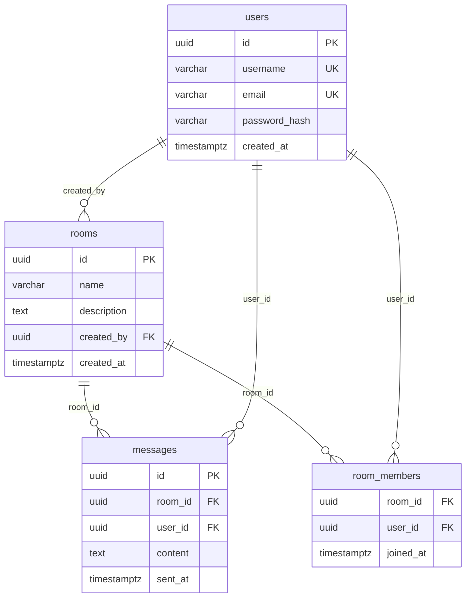

# PRD: ChatApp

> A real‑time text chat application with user authentication, room management, and instant messaging.

_Original request: "buatkan prd membuat aplikasi chat"_

## 1. Problem Statement

Users need a simple, secure, and fast way to communicate in real time across multiple chat rooms without the complexity of existing solutions.

## 2. Goals

- Enable secure user registration and authentication with JWT tokens.
- Support creation, listing, and joining of chat rooms.
- Provide instant message sending and real‑time delivery.
- Store message history with pagination for rooms.
- Display online presence of participants.

## 3. Target Users

- General consumers
- Teams needing quick internal chat
- Developers looking for a lightweight chat service

## 4. Tech Stack

| Layer | Choice |
|---|---|
| Frontend | React + TypeScript |
| Backend | Node.js + Express + TypeScript |
| Database | PostgreSQL |
| Other | Socket.IO, Docker, CI/CD (GitHub Actions), Jest / Supertest |

## 5. Features & Acceptance Criteria

### F1: User Registration & Authentication `[MUST]`

Allows new users to sign up and existing users to log in, returning a JWT token for protected endpoints.

**User story:** As a new user, I want to register with a username and password so that I can access the chat service.

**Acceptance criteria:**

1. **Given** A user submits a valid username and password to /api/auth/register **When** the request is processed **Then** a new user record is created and a success response with a JWT token is returned
2. **Given** An existing user submits correct credentials to /api/auth/login **When** the request is processed **Then** a JWT token is returned and the user is authenticated
3. **Given** A protected endpoint is called with an invalid or expired token **When** the request is made **Then** a 401 Unauthorized response is returned

### F2: Create & List Chat Rooms `[MUST]`

Users can create new chat rooms with a name and description, and view a list of all available rooms.

**User story:** As a user, I want to create a chat room with a name and description, and see all existing rooms.

**Acceptance criteria:**

1. **Given** A logged‑in user sends a POST to /api/rooms with name and description **When** the room is created **Then** the room is persisted and returned with an ID
2. **Given** A logged‑in user requests GET /api/rooms **When** rooms exist **Then** a list of rooms (id, name, description, member count) is returned
3. **Given** A user attempts to create a room without a name **When** the request is processed **Then** a 400 Bad Request is returned

### F3: Send & Receive Messages `[MUST]`

Real‑time messaging within a room, persisting messages to the database and delivering them instantly to participants.

**User story:** As a user, I want to send a text message to a room and see it instantly.

**Acceptance criteria:**

1. **Given** A logged‑in user sends a POST to /api/messages with room_id and content **When** the message is saved **Then** the message is returned with an ID and timestamp
2. **Given** A user subscribes to a room's Socket.IO channel **When** another user sends a message to that room **Then** the message is broadcast to all subscribers in real time
3. **Given** A message is sent to a non‑existent room **When** the request is processed **Then** a 404 Not Found response is returned

### F4: Message History & Pagination `[SHOULD]`

Retrieve message history for a room with pagination to support scrolling through past messages.

**User story:** As a user, I want to scroll through past messages in a room.

**Acceptance criteria:**

1. **Given** A logged‑in user requests GET /api/rooms/:id/messages?page=1&limit=20 **When** messages exist **Then** up to 20 messages are returned with pagination metadata
2. **Given** A user requests messages for a room they are not a member of **When** the request is processed **Then** a 403 Forbidden response is returned
3. **Given** A user requests a page beyond the total pages **When** the request is processed **Then** an empty array is returned with correct pagination metadata

### F5: Presence & Online Status `[SHOULD]`

Show which users are online in a room, updating in real time as users join/leave.

**User story:** As a user, I want to see the online status of other participants.

**Acceptance criteria:**

1. **Given** A user connects to Socket.IO and joins a room **When** the connection is established **Then** a presence event is emitted to all room subscribers indicating the user is online
2. **Given** A user disconnects from Socket.IO **When** the connection closes **Then** a presence event is emitted indicating the user is offline
3. **Given** A client subscribes to presence updates for a room **When** a user comes online **Then** the client receives a presence update with the user's ID and timestamp

### F6: WebSocket Real‑Time Communication `[COULD]`

Use Socket.IO for bi‑directional real‑time messaging, reducing latency compared to HTTP polling.

**User story:** As a user, I want messages to appear instantly without page refresh.

**Acceptance criteria:**

1. **Given** A client establishes a WebSocket connection to /socket.io **When** a message is sent via Socket.IO **Then** the message is broadcast to all room subscribers within 100ms
2. **Given** A client sends a typing indicator event **When** another user is in the same room **Then** the recipient receives a typing event
3. **Given** The server restarts while clients are connected **When** clients attempt to reconnect **Then** clients automatically re‑establish the connection and resume receiving events

## 6. Non-Functional Requirements

- Performance: messages should be delivered within 100ms under moderate load.
- Security: JWT tokens must be HTTP‑Only, use HTTPS, and have a 24‑hour expiration.
- Accessibility: UI components must meet WCAG 2.1 AA standards.
- Scalability: Architecture should support horizontal scaling of message handling.

## 7. Database Design



### Table `users`

Application users with authentication details.

| Column | Type | Constraints | Note |
|---|---|---|---|
| `id` | uuid | PK |  |
| `username` | varchar | UNIQUE, NOT NULL |  |
| `email` | varchar | UNIQUE, NOT NULL |  |
| `password_hash` | varchar | NOT NULL |  |
| `created_at` | timestamptz | NOT NULL |  |

### Table `rooms`

Chat rooms created by users.

| Column | Type | Constraints | Note |
|---|---|---|---|
| `id` | uuid | PK |  |
| `name` | varchar | NOT NULL |  |
| `description` | text | NULL |  |
| `created_by` | uuid | FK → users.id, NOT NULL |  |
| `created_at` | timestamptz | NOT NULL |  |

### Table `messages`

Messages sent within rooms.

| Column | Type | Constraints | Note |
|---|---|---|---|
| `id` | uuid | PK |  |
| `room_id` | uuid | FK → rooms.id, NOT NULL |  |
| `user_id` | uuid | FK → users.id, NOT NULL |  |
| `content` | text | NOT NULL |  |
| `sent_at` | timestamptz | NOT NULL |  |

### Table `room_members`

Many‑to‑many relationship between users and rooms.

| Column | Type | Constraints | Note |
|---|---|---|---|
| `room_id` | uuid | FK → rooms.id, NOT NULL |  |
| `user_id` | uuid | FK → users.id, NOT NULL |  |
| `joined_at` | timestamptz | NOT NULL |  |

<details><summary>SQL DDL</summary>

```sql
-- Application users with authentication details.
CREATE TABLE users (
  id UUID PRIMARY KEY,
  username VARCHAR NOT NULL UNIQUE,
  email VARCHAR NOT NULL UNIQUE,
  password_hash VARCHAR NOT NULL,
  created_at TIMESTAMPTZ NOT NULL
);

-- Chat rooms created by users.
CREATE TABLE rooms (
  id UUID PRIMARY KEY,
  name VARCHAR NOT NULL,
  description TEXT,
  created_by UUID NOT NULL REFERENCES users(id),
  created_at TIMESTAMPTZ NOT NULL
);

-- Messages sent within rooms.
CREATE TABLE messages (
  id UUID PRIMARY KEY,
  room_id UUID NOT NULL REFERENCES rooms(id),
  user_id UUID NOT NULL REFERENCES users(id),
  content TEXT NOT NULL,
  sent_at TIMESTAMPTZ NOT NULL
);

-- Many‑to‑many relationship between users and rooms.
CREATE TABLE room_members (
  room_id UUID NOT NULL REFERENCES rooms(id),
  user_id UUID NOT NULL REFERENCES users(id),
  joined_at TIMESTAMPTZ NOT NULL
);
```

</details>

## 8. API Contract

| Method | Path | Auth | Description |
|---|---|---|---|
| POST | `/api/auth/register` | No | Register a new user and return a JWT token. |
| POST | `/api/auth/login` | No | Authenticate user and return a JWT token. |
| GET | `/api/rooms` | Yes | List all chat rooms for the authenticated user. |
| POST | `/api/rooms` | Yes | Create a new chat room. |
| GET | `/api/rooms/:id/messages` | Yes | Retrieve paginated message history for a room. |
| POST | `/api/messages` | Yes | Send a new message to a room. |
| GET | `/api/users/online` | Yes | Get list of currently online users (optional). |
| WS | `/socket.io` | Yes | WebSocket endpoint for real‑time messaging and presence. |

## 9. Implementation Plan

### Phase 1: Architecture & Setup

Define project structure, choose CI/CD, set up Docker, create shared libraries and linting rules.

- [ ] **T1** Initialize monorepo with root package.json and workspaces _(Todo)_
- [ ] **T2** Add README and contribution guidelines _(Todo)_

### Phase 2: Core Backend & DB

Design and create PostgreSQL schema, implement basic CRUD repositories, and set up environment configuration.

- [ ] **T3** Design database schema and migration files _(Todo)_
- [ ] **T4** Create users table _(Todo)_
- [ ] **T5** Create rooms table _(Todo)_
- [ ] **T6** Create messages table _(Todo)_
- [ ] **T7** Create room_members join table _(Todo)_

### Phase 3: Authentication & User Management

Implement registration and login endpoints, JWT handling, password hashing, and unit tests.

- [ ] **T8** Implement user registration endpoint _(Todo)_
- [ ] **T9** Implement login endpoint and JWT generation _(Todo)_

### Phase 4: Chat Core (Rooms & Messaging)

Build room creation/list endpoints, message sending, and message history with pagination.

- [ ] **T11** Implement create room endpoint _(Todo)_
- [ ] **T12** Implement list rooms endpoint _(Todo)_
- [ ] **T13** Implement send message endpoint _(Todo)_
- [ ] **T14** Implement message history endpoint with pagination _(Todo)_

### Phase 5: Real‑Time & UI

Add Socket.IO server, presence tracking, and develop React frontend components for auth, room list, and chat window.

- [ ] **T15** Implement presence tracking in database _(Todo)_
- [ ] **T16** Set up Socket.IO server and middleware _(Todo)_
- [ ] **T17** Implement real‑time message broadcasting _(Todo)_
- [ ] **T18** Build React login component _(Todo)_
- [ ] **T19** Build React register component _(Todo)_
- [ ] **T20** Build React room list component _(Todo)_
- [ ] **T21** Build React chat window component _(Todo)_
- [ ] **T22** Integrate JWT authentication into React routes _(Todo)_

### Phase 6: Testing & Deployment

Write integration/e2e tests, configure Docker images, set up CI pipeline, and perform security hardening.

- [ ] **T10** Write unit tests for authentication _(Todo)_
- [ ] **T23** Write integration tests for chat flow _(Todo)_
- [ ] **T24** Configure Docker for backend and frontend _(Todo)_
- [ ] **T25** Set up CI pipeline with GitHub Actions _(Todo)_
- [ ] **T26** Add security hardening (helmet, rate limiting) _(Todo)_
- [ ] **T27** Implement performance monitoring (Prometheus exporter) _(Todo)_

## 10. Task Details

### T1: Initialize monorepo with root package.json and workspaces
- **Status:** Todo
- **Phase:** 1
- **Priority:** must

Create root package.json, set up pnpm workspaces for frontend and backend, and add basic scripts (dev, build, test).

**Definition of Done:**
- [ ] Repository cloned and `pnpm install` runs without errors
- [ ] All workspaces are present

### T2: Add README and contribution guidelines
- **Status:** Todo
- **Phase:** 1
- **Priority:** must

Write a comprehensive README covering setup, deployment, and API usage; add a CONTRIBUTING.md.

**Definition of Done:**
- [ ] README includes installation, running, and testing instructions
- [ ] CONTRIBUTING outlines coding standards

### T3: Design database schema and migration files
- **Status:** Todo
- **Phase:** 2
- **Priority:** must

Create SQL migration scripts for users, rooms, messages, and room_members tables with constraints and indexes.

**Definition of Done:**
- [ ] Migrations apply cleanly with `pnpm db:migrate`
- [ ] Schema matches ER diagram

### T4: Create users table
- **Status:** Todo
- **Phase:** 2
- **Priority:** must
- **Features:** F1 – User Registration & Authentication

Implement migration to create the users table with id, username, email, password_hash, and created_at columns.

**Definition of Done:**
- [ ] Table exists in DB
- [ ] Columns have correct types and constraints

### T5: Create rooms table
- **Status:** Todo
- **Phase:** 2
- **Priority:** must
- **Features:** F2 – Create & List Chat Rooms

Implement migration to create the rooms table with id, name, description, created_by (FK to users), and created_at.

**Definition of Done:**
- [ ] Table exists in DB
- [ ] Foreign key constraint to users.id is enforced

### T6: Create messages table
- **Status:** Todo
- **Phase:** 2
- **Priority:** must
- **Features:** F3 – Send & Receive Messages

Implement migration to create the messages table with id, room_id (FK to rooms), user_id (FK to users), content, and sent_at.

**Definition of Done:**
- [ ] Table exists in DB
- [ ] Foreign keys reference correct tables

### T7: Create room_members join table
- **Status:** Todo
- **Phase:** 2
- **Priority:** must
- **Features:** F2 – Create & List Chat Rooms, F5 – Presence & Online Status

Implement migration for room_members linking users and rooms with joined_at timestamp.

**Definition of Done:**
- [ ] Join table created
- [ ] Composite uniqueness constraint on (room_id, user_id)

### T8: Implement user registration endpoint
- **Status:** Todo
- **Phase:** 3
- **Priority:** must
- **Features:** F1 – User Registration & Authentication

Create POST /api/auth/register in auth controller, hash password, save user, return JWT.

**Definition of Done:**
- [ ] Endpoint returns 201 with token on success
- [ ] Password is stored as hash

### T9: Implement login endpoint and JWT generation
- **Status:** Todo
- **Phase:** 3
- **Priority:** must
- **Features:** F1 – User Registration & Authentication

Create POST /api/auth/login, validate credentials, sign JWT with 24h expiry, return token.

**Definition of Done:**
- [ ] Endpoint returns 200 with token for valid credentials
- [ ] Invalid credentials return 401

### T10: Write unit tests for authentication
- **Status:** Todo
- **Phase:** 6
- **Priority:** must
- **Features:** F1 – User Registration & Authentication

Add Jest tests for registration and login controllers, covering success and error cases.

**Definition of Done:**
- [ ] All auth unit tests pass
- [ ] Test coverage > 80% for auth module

### T11: Implement create room endpoint
- **Status:** Todo
- **Phase:** 4
- **Priority:** must
- **Features:** F2 – Create & List Chat Rooms

Add POST /api/rooms handler that validates name, creates room, sets created_by from JWT, adds creator as member.

**Definition of Done:**
- [ ] Room created and returned with ID
- [ ] Creator automatically added as room member

### T12: Implement list rooms endpoint
- **Status:** Todo
- **Phase:** 4
- **Priority:** must
- **Features:** F2 – Create & List Chat Rooms

Add GET /api/rooms that returns rooms the authenticated user has joined, with member count.

**Definition of Done:**
- [ ] Endpoint returns list of rooms with name, description, member count
- [ ] Only rooms user joined are shown

### T13: Implement send message endpoint
- **Status:** Todo
- **Phase:** 4
- **Priority:** must
- **Features:** F3 – Send & Receive Messages

Add POST /api/messages that validates room_id and content, saves message, returns message object.

**Definition of Done:**
- [ ] Message persisted and returned with ID and timestamp
- [ ] Unauthorized room access returns 403

### T14: Implement message history endpoint with pagination
- **Status:** Todo
- **Phase:** 4
- **Priority:** should
- **Features:** F4 – Message History & Pagination

Add GET /api/rooms/:id/messages supporting query parameters page and limit, returns paginated messages.

**Definition of Done:**
- [ ] Paginated response includes messages, total, page, limit
- [ ] Invalid pagination defaults handled gracefully

### T15: Implement presence tracking in database
- **Status:** Todo
- **Phase:** 5
- **Priority:** should
- **Features:** F5 – Presence & Online Status

Add a presence table (or use Redis) to store user online status per room; create helper functions.

**Definition of Done:**
- [ ] Presence data can be inserted/updated on connection
- [ ] Presence can be queried for a room

### T16: Set up Socket.IO server and middleware
- **Status:** Todo
- **Phase:** 5
- **Priority:** could
- **Features:** F6 – WebSocket Real‑Time Communication

Initialize Socket.IO in Express, attach authentication middleware, and configure message and presence namespaces.

**Definition of Done:**
- [ ] Socket.IO instance is listening on /socket.io
- [ ] Authenticated sockets can join rooms

### T17: Implement real‑time message broadcasting
- **Status:** Todo
- **Phase:** 5
- **Priority:** could
- **Features:** F3 – Send & Receive Messages, F6 – WebSocket Real‑Time Communication

Handle incoming message events, persist to DB, and broadcast to all room subscribers via Socket.IO.

**Definition of Done:**
- [ ] Messages sent via Socket.IO appear instantly to all room subscribers
- [ ] Broadcast includes sender ID and timestamp

### T18: Build React login component
- **Status:** Todo
- **Phase:** 5
- **Priority:** must
- **Features:** F1 – User Registration & Authentication

Create LoginPage component with username/password fields, submit to /api/auth/login, store JWT in httpOnly cookie.

**Definition of Done:**
- [ ] Login form renders and validates
- [ ] Successful login redirects to room list

### T19: Build React register component
- **Status:** Todo
- **Phase:** 5
- **Priority:** must
- **Features:** F1 – User Registration & Authentication

Create RegisterPage component with fields for username, email, password, submit to /api/auth/register.

**Definition of Done:**
- [ ] Registration form renders and validates
- [ ] Successful registration redirects to login

### T20: Build React room list component
- **Status:** Todo
- **Phase:** 5
- **Priority:** must
- **Features:** F2 – Create & List Chat Rooms

Create RoomList component that fetches /api/rooms, displays rooms, and navigates to chat on selection.

**Definition of Done:**
- [ ] Room list loads and shows each room's name and description
- [ ] Clicking a room opens chat view

### T21: Build React chat window component
- **Status:** Todo
- **Phase:** 5
- **Priority:** must
- **Features:** F3 – Send & Receive Messages, F4 – Message History & Pagination, F5 – Presence & Online Status

Create ChatWindow component that joins Socket.IO room, displays messages, and provides a message input.

**Definition of Done:**
- [ ] Chat window shows messages in real time
- [ ] New messages appear without page refresh

### T22: Integrate JWT authentication into React routes
- **Status:** Todo
- **Phase:** 5
- **Priority:** must
- **Features:** F1 – User Registration & Authentication

Add protected route logic using the httpOnly cookie, redirect to login if missing token.

**Definition of Done:**
- [ ] Protected routes require authentication
- [ ] Unauthenticated user redirected to login

### T23: Write integration tests for chat flow
- **Status:** Todo
- **Phase:** 6
- **Priority:** must
- **Features:** F1 – User Registration & Authentication, F2 – Create & List Chat Rooms, F3 – Send & Receive Messages, F5 – Presence & Online Status

Create end‑to‑end tests using Supertest and Cypress covering registration, room creation, messaging, and presence.

**Definition of Done:**
- [ ] All integration tests pass
- [ ] Scenarios cover happy path and error cases

### T24: Configure Docker for backend and frontend
- **Status:** Todo
- **Phase:** 6
- **Priority:** must

Create Dockerfile and docker-compose for Node service and Nginx for React, define environment variables.

**Definition of Done:**
- [ ] Docker images build successfully
- [ ] Services start and expose required ports

### T25: Set up CI pipeline with GitHub Actions
- **Status:** Todo
- **Phase:** 6
- **Priority:** must

Create workflow that runs lint, tests, and builds on push to main, and deploys to staging environment.

**Definition of Done:**
- [ ] CI runs on PR and main
- [ ] All checks pass automatically

### T26: Add security hardening (helmet, rate limiting)
- **Status:** Todo
- **Phase:** 6
- **Priority:** should

Integrate helmet, express-rate-limit, and CORS policies to protect endpoints.

**Definition of Done:**
- [ ] Security headers present in responses
- [ ] Rate limiting blocks excessive requests

### T27: Implement performance monitoring (Prometheus exporter)
- **Status:** Todo
- **Phase:** 6
- **Priority:** could

Add a simple metrics endpoint exposing request count and latency for monitoring.

**Definition of Done:**
- [ ] Metrics endpoint returns JSON with counters
- [ ] Metrics can be scraped by Prometheus

## 11. Edge Cases

- User attempts to send a message to a room they are not a member of
- Duplicate messages due to network retries
- Large message history causing pagination performance issues
- Socket.IO connection drops and client reconnection
- Concurrent room creation with same name
- Invalid JWT token or token missing from request
- Database connection failure during message persistence
- Spam messages from a single user

## 12. Out of Scope (DO NOT BUILD)

- ❌ Video or voice calling features
- ❌ File upload and sharing
- ❌ Advanced UI theming and custom branding
- ❌ Admin dashboard for moderation
- ❌ Push notifications to mobile devices
- ❌ Multi‑device sync across browsers
- ❌ Real‑time typing indicators (planned for future iteration)

## 13. Instructions for AI Coding Agents

If the `prd-studio` MCP server is connected, use it instead of guessing:
1. `get_next_task` → pick the next task.
2. `update_task_status` with `in_progress` before you start coding.
3. Use `get_db_schema` / `get_prd` whenever you need context.
4. When every Definition of Done item passes, call `update_task_status` with `done` and a short note of files changed.
