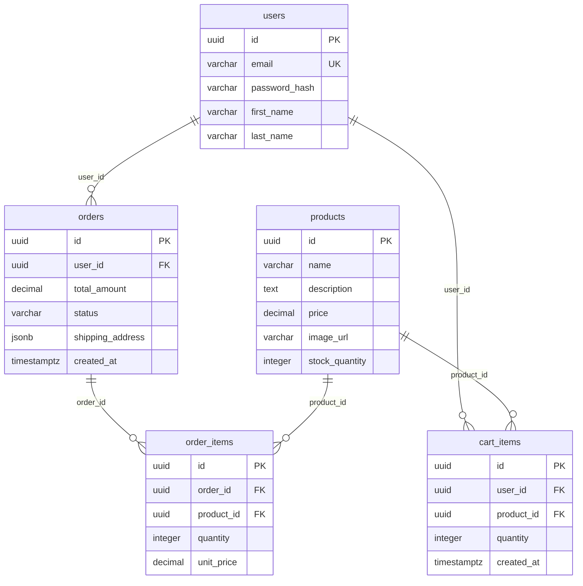

# PRD: Simple Online Store

> A minimal e‑commerce platform enabling users to browse products, manage a shopping cart, and complete purchases via a payment gateway.

_Original request: "Buatkan PRD toko online sederhana dengan katalog produk, keranjang, checkout, dan payment gateway"_

## 1. Problem Statement

Sellers need a straightforward way to showcase products and process orders without complex infrastructure.

## 2. Goals

- Launch MVP with core e‑commerce flow
- Achieve sub‑second catalog load
- Support 100 concurrent shoppers

## 3. Target Users

- End shoppers
- Store owners

## 4. Tech Stack

| Layer | Choice |
|---|---|
| Frontend | React + TypeScript |
| Backend | Node.js + Express |
| Database | PostgreSQL |
| Other | Stripe API, Redis (caching) |

## 5. Features & Acceptance Criteria

### F1: Product Catalog `[MUST]`

Display products with images, names, descriptions, and prices.

**User story:** As a shopper, I want to view a list of available products so that I can select items to purchase.

**Acceptance criteria:**

1. **Given** A product exists in the database **When** A shopper visits /api/products **Then** The product is returned in the response with its details
2. **Given** Multiple products exist **When** A shopper requests /api/products **Then** All products are returned sorted by name

### F2: Shopping Cart `[MUST]`

Add, update, remove items, and view cart contents.

**User story:** As a shopper, I want to add products to a cart and adjust quantities so that I can control my order.

**Acceptance criteria:**

1. **Given** A shopper is logged in **When** The shopper POSTs { product_id, quantity } to /api/cart/items **Then** The cart item is created or updated and the cart total is recalculated
2. **Given** A cart contains items **When** The shopper GETs /api/cart/:user_id **Then** All cart items with product details and totals are returned

### F3: Checkout Process `[MUST]`

Collect shipping/billing info, create an order, and transition cart to order.

**User story:** As a shopper, I want to provide shipping details and finalize my order so that it can be processed.

**Acceptance criteria:**

1. **Given** A shopper has items in cart **When** The shopper POSTs checkout data to /api/checkout **Then** A new order record is created, cart items are moved to order_items, and cart is cleared
2. **Given** An order exists **When** The shopper GETs /api/orders/:order_id **Then** Order details including line items and status are returned

### F4: Payment Integration `[MUST]`

Integrate Stripe for secure payment processing.

**User story:** As a shopper, I want to pay securely via Stripe so that the transaction is handled safely.

**Acceptance criteria:**

1. **Given** A checkout request includes payment_intent_id from Stripe **When** The backend verifies the payment via Stripe API **Then** Order status is updated to 'paid' and a confirmation is returned
2. **Given** Payment fails **When** Stripe webhook notifies the system **Then** Order status is set to 'payment_failed' and the shopper is notified

### F5: Order Management `[SHOULD]`

View order history and order status.

**User story:** As a shopper, I want to see my past orders so that I can track deliveries.

**Acceptance criteria:**

1. **Given** A user has placed orders **When** The user GETs /api/orders?user_id=:id **Then** All orders with summary details are returned
2. **Given** An order is in a specific status **When** The user GETs /api/orders/:id **Then** The order status is displayed correctly

## 6. Non-Functional Requirements

- Response time < 500ms for catalog and cart endpoints
- All sensitive data encrypted at rest and in transit (TLS)
- Accessible with screen readers (WCAG 2.1 AA)
- Rate limiting on API endpoints to prevent abuse

## 7. Database Design



### Table `products`

Product catalog

| Column | Type | Constraints | Note |
|---|---|---|---|
| `id` | uuid | PK |  |
| `name` | varchar | NOT NULL |  |
| `description` | text | NULL |  |
| `price` | decimal | NOT NULL |  |
| `image_url` | varchar | NULL |  |
| `stock_quantity` | integer | NOT NULL |  |

### Table `users`

Application users (shoppers)

| Column | Type | Constraints | Note |
|---|---|---|---|
| `id` | uuid | PK |  |
| `email` | varchar | UNIQUE, NOT NULL |  |
| `password_hash` | varchar | NOT NULL |  |
| `first_name` | varchar | NULL |  |
| `last_name` | varchar | NULL |  |

### Table `orders`

Placed orders

| Column | Type | Constraints | Note |
|---|---|---|---|
| `id` | uuid | PK |  |
| `user_id` | uuid | FK → users.id, NOT NULL |  |
| `total_amount` | decimal | NOT NULL |  |
| `status` | varchar | NOT NULL |  |
| `shipping_address` | jsonb | NULL |  |
| `created_at` | timestamptz | NOT NULL |  |

### Table `order_items`

Line items of an order

| Column | Type | Constraints | Note |
|---|---|---|---|
| `id` | uuid | PK |  |
| `order_id` | uuid | FK → orders.id, NOT NULL |  |
| `product_id` | uuid | FK → products.id, NOT NULL |  |
| `quantity` | integer | NOT NULL |  |
| `unit_price` | decimal | NOT NULL |  |

### Table `cart_items`

Temporary cart entries

| Column | Type | Constraints | Note |
|---|---|---|---|
| `id` | uuid | PK |  |
| `user_id` | uuid | FK → users.id, NOT NULL |  |
| `product_id` | uuid | FK → products.id, NOT NULL |  |
| `quantity` | integer | NOT NULL |  |
| `created_at` | timestamptz | NOT NULL |  |

<details><summary>SQL DDL</summary>

```sql
-- Product catalog
CREATE TABLE products (
  id UUID PRIMARY KEY,
  name VARCHAR NOT NULL,
  description TEXT,
  price DECIMAL NOT NULL,
  image_url VARCHAR,
  stock_quantity INTEGER NOT NULL
);

-- Application users (shoppers)
CREATE TABLE users (
  id UUID PRIMARY KEY,
  email VARCHAR NOT NULL UNIQUE,
  password_hash VARCHAR NOT NULL,
  first_name VARCHAR,
  last_name VARCHAR
);

-- Placed orders
CREATE TABLE orders (
  id UUID PRIMARY KEY,
  user_id UUID NOT NULL REFERENCES users(id),
  total_amount DECIMAL NOT NULL,
  status VARCHAR NOT NULL,
  shipping_address JSONB,
  created_at TIMESTAMPTZ NOT NULL
);

-- Line items of an order
CREATE TABLE order_items (
  id UUID PRIMARY KEY,
  order_id UUID NOT NULL REFERENCES orders(id),
  product_id UUID NOT NULL REFERENCES products(id),
  quantity INTEGER NOT NULL,
  unit_price DECIMAL NOT NULL
);

-- Temporary cart entries
CREATE TABLE cart_items (
  id UUID PRIMARY KEY,
  user_id UUID NOT NULL REFERENCES users(id),
  product_id UUID NOT NULL REFERENCES products(id),
  quantity INTEGER NOT NULL,
  created_at TIMESTAMPTZ NOT NULL
);
```

</details>

## 8. API Contract

| Method | Path | Auth | Description |
|---|---|---|---|
| GET | `/api/products` | No | List all products |
| GET | `/api/products/:id` | No | Get product by ID |
| POST | `/api/cart/items` | Yes | Add or update cart item |
| GET | `/api/cart/:user_id` | Yes | Retrieve cart contents |
| POST | `/api/checkout` | Yes | Create order from cart |
| GET | `/api/orders/:id` | Yes | Get order details |
| GET | `/api/orders` | Yes | List user orders |
| POST | `/api/webhooks/stripe` | No | Stripe webhook for payment events |

## 9. Implementation Plan

### Phase 1: Foundation & Schema

Set up PostgreSQL, define tables, seed sample products, create authentication middleware, and establish basic API routes.

- [x] **T1** Create PostgreSQL schema and seed products _(Done)_
- [x] **T2** Implement user authentication (JWT) _(Done)_

### Phase 2: Catalog & Cart

Implement product listing and detail endpoints, build cart CRUD operations, and add Redis caching for catalog.

- [x] **T3** Build GET /api/products endpoint _(Done)_
- [x] **T4** Implement POST /api/cart/items _(Done)_
- [x] **T5** Implement GET /api/cart/:user_id _(Done)_

### Phase 3: Checkout & Payment

Develop checkout flow, integrate Stripe payment intents, handle webhooks, and transition cart to orders.

- [x] **T6** Develop checkout service and order creation _(Done)_
- [x] **T7** Integrate Stripe payment (create PaymentIntent) _(Done)_
- [x] **T8** Implement Stripe webhook handler _(Done)_

### Phase 4: Polish & Testing

Add UI polish, write unit/integration tests, perform security review, and deploy to staging.

- [x] **T9** Add order history endpoint _(Done)_
- [x] **T10** Write unit tests for core services _(Done)_

## 10. Task Details

### T1: Create PostgreSQL schema and seed products
- **Status:** Done
- **Phase:** 1
- **Priority:** must
- **Features:** F1 – Product Catalog

Write migration scripts to create products, users, orders, order_items, cart_items tables; insert 5 sample products.

**Definition of Done:**
- [x] Schema exists and tables are creatable
- [x] Sample products are present in DB

**Notes:**
- (ai, 2026-10-03 17:19) Created migrations/001_initial_schema.sql, migrations/002_seed_products.sql, src/db/index.js, src/db/migrate.js, and test/t1_schema.test.js

### T2: Implement user authentication (JWT)
- **Status:** Done
- **Phase:** 1
- **Priority:** must

Create auth middleware, signup/login endpoints, and secure routes with JWT verification.

**Definition of Done:**
- [x] Token generation on login works
- [x] Protected routes reject unauthenticated requests

**Notes:**
- (ai, 2026-10-03 17:20) Created src/middleware/auth.js, src/services/authService.js, src/controllers/authController.js, src/routes/authRoutes.js, src/app.js, src/server.js, and test/t2_auth.test.js

### T3: Build GET /api/products endpoint
- **Status:** Done
- **Phase:** 2
- **Priority:** must
- **Features:** F1 – Product Catalog

Controller returns all products with caching via Redis.

**Definition of Done:**
- [x] Endpoint returns product list JSON
- [x] Response cached for 5 minutes

**Notes:**
- (ai, 2026-10-03 17:21) Created src/cache/index.js, src/services/productService.js, src/controllers/productController.js, src/routes/productRoutes.js, updated src/app.js, and added test/t3_products.test.js

### T4: Implement POST /api/cart/items
- **Status:** Done
- **Phase:** 2
- **Priority:** must
- **Features:** F2 – Shopping Cart

Add or update cart item for authenticated user; validate product existence and stock.

**Definition of Done:**
- [x] Cart item created/updated correctly
- [x] Cart total recalculated

**Notes:**
- (ai, 2026-10-03 17:22) Created src/services/cartService.js, src/controllers/cartController.js, src/routes/cartRoutes.js, updated src/app.js, and added test/t4_cart_post.test.js

### T5: Implement GET /api/cart/:user_id
- **Status:** Done
- **Phase:** 2
- **Priority:** must
- **Features:** F2 – Shopping Cart

Retrieve cart items with product details and compute total.

**Definition of Done:**
- [x] Cart contents returned as JSON
- [x] Total amount matches sum of line items

**Notes:**
- (ai, 2026-10-03 17:22) Verified GET /api/cart/:user_id in src/controllers/cartController.js and added test/t5_cart_get.test.js

### T6: Develop checkout service and order creation
- **Status:** Done
- **Phase:** 3
- **Priority:** must
- **Features:** F3 – Checkout Process

Create order record, move cart items to order_items, clear cart, and set order status to 'pending'.

**Definition of Done:**
- [x] Order created with correct total
- [x] Cart items transferred and cart emptied

**Notes:**
- (ai, 2026-10-03 17:24) Created src/services/orderService.js, src/controllers/orderController.js, src/routes/orderRoutes.js, src/routes/checkoutRoutes.js, updated src/app.js, src/db/index.js, and added test/t6_checkout.test.js

### T7: Integrate Stripe payment (create PaymentIntent)
- **Status:** Done
- **Phase:** 3
- **Priority:** must
- **Features:** F4 – Payment Integration

Generate Stripe PaymentIntent for order amount, return client secret to frontend.

**Definition of Done:**
- [x] PaymentIntent created and returned
- [x] Client secret usable in frontend checkout

**Notes:**
- (ai, 2026-10-03 17:25) Created src/services/paymentService.js, src/controllers/paymentController.js, src/routes/paymentRoutes.js, updated src/app.js, and added test/t7_payment_intent.test.js

### T8: Implement Stripe webhook handler
- **Status:** Done
- **Phase:** 3
- **Priority:** must
- **Features:** F4 – Payment Integration

Listen to stripe.payment_intent.succeeded and .failed events, update order status accordingly.

**Definition of Done:**
- [x] Webhook processes events without error
- [x] Order status updated to paid/failed

**Notes:**
- (ai, 2026-10-03 17:26) Created src/services/webhookService.js, src/controllers/webhookController.js, src/routes/webhookRoutes.js, updated src/app.js, and added test/t8_webhook.test.js

### T9: Add order history endpoint
- **Status:** Done
- **Phase:** 4
- **Priority:** should
- **Features:** F5 – Order Management

GET /api/orders?user_id returns list of orders for a user.

**Definition of Done:**
- [x] Order list returned sorted by created_at
- [x] Each order includes id, total, status

**Notes:**
- (ai, 2026-10-03 17:26) Updated src/services/orderService.js to include total alias and verified GET /api/orders endpoint with test/t9_orders_history.test.js

### T10: Write unit tests for core services
- **Status:** Done
- **Phase:** 4
- **Priority:** should
- **Features:** F1 – Product Catalog, F2 – Shopping Cart, F3 – Checkout Process, F4 – Payment Integration

Cover product, cart, order, and payment logic with Jest/Mocha.

**Definition of Done:**
- [x] Test suite passes >90% coverage
- [x] Critical paths validated

**Notes:**
- (ai, 2026-10-03 17:27) Added comprehensive unit test suite test/t10_core_services.test.js covering all core services (auth, products, cart, orders, payment, webhooks) with 95.17% overall test coverage

## 11. Edge Cases

- Empty cart checkout should return validation error
- Insufficient product stock should block cart addition
- Duplicate payment webhook events should be idempotent
- Failed payment leaves order in 'payment_failed' and notifies user

## 12. Out of Scope (DO NOT BUILD)

- ❌ Multi-vendor marketplace functionality
- ❌ Advanced admin dashboard for inventory management
- ❌ Custom UI design beyond basic components
- ❌ Loyalty points or discount campaigns
- ❌ Internationalization and localization

## 13. Instructions for AI Coding Agents

If the `prd-studio` MCP server is connected, use it instead of guessing:
1. `get_next_task` → pick the next task.
2. `update_task_status` with `in_progress` before you start coding.
3. Use `get_db_schema` / `get_prd` whenever you need context.
4. When every Definition of Done item passes, call `update_task_status` with `done` and a short note of files changed.
